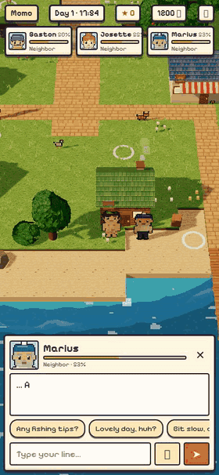

<p align="center">
  
</p>

# RAGOTS 🏝️ — the island that gossips about you

> *Ragots* is French for "gossip". On this island, everything you say **will** be repeated… and twisted.

A cozy, mobile-first HD-2D island game where every islander is an AI with a personality, a memory and a very loose tongue.
Built in one day for the [Paris AI Gaming Hackathon](https://luma.com/par-hack) ({Tech: Europe}).

📱💻 **Play it on your phone or on your computer, it's fully responsive.** Portrait, one thumb on mobile: tap to walk, tap an islander to talk. On desktop: WASD / arrows to walk, `E` to talk, or just click. Same game, right in the browser, nothing to install.

## The pitch

You wash up naked on a tiny island. Three locals live there — and they talk. To you, and **about** you.

- Insult the fisherman, and the baker will hear about it by tomorrow.
- Lie to her face, and she might catch you.
- Push someone's friendship too low, and you'll get slapped… then punched… then worse. 💀

Your goal: build the prettiest, most prestigious island in town — without becoming its favorite rumor.

## Meet the islanders

| | Who | Vibe |
|---|---|---|
| 💰 | **Gaston**, the merchant | Stingy, fast-talking hustler. Loves flattery, hates scams he didn't run himself. |
| 🥖 | **Josette**, the baker | Adorable, nosy, the island's gossip hub. Knows everything before you do. |
| 🎣 | **Marius**, the fisherman | Slow, philosophical, touchy. Best friend of Josette (so, careful). |

## What you can do

- 💬 **Talk freely** — type (or speak) anything. Islanders answer in character, with their own voice.
- 🗞️ **Leave and come back** — "Come back in 8 h" simulates island life: islanders chat, rumors spread and mutate, relations shift. Read it all in the *Gossip Gazette*.
- ❤️ **Relationships that bite** — friendship gauges go from BFF to slaps (35%), cartoon brawls (20%)… and murder (0%).
- 🎣 **Fish** — tap the water, strike when the float dips, sell your catch to Gaston or gift it to win hearts.
- 🤝 **Haggle** with Gaston, 🛋️ **shop** for furniture and clothes, 🏠 **decorate** your house and island to raise its prestige (see below: *what you say sets the price*).
- 🐔 A living island: chickens, cats, crabs, seagulls, smoking chimneys.

## 🧭 Jury walkthrough: try everything in ~3 minutes

Not sure where to start? Follow this path, it goes through every feature. Everything is typed in free text, so feel free to improvise: the islanders will react to *whatever* you say.

**1. Wash up (30 s)**
- Hit **PLAY**, type **your own name** (the islanders will use it) and pick a look. Name your island.
- Watch the raft cutscene: you drift in stark naked. You'll stay that way until you buy clothes.

**2. Make a friend: Josette, the baker (40 s)**
- Walk up to Josette (tap her, or `E` on desktop) and be nice: *"Your croissants smell amazing!"*. Her gauge goes up. From 75% she gets a ❤️ over her head.
- Ask her about the others: *"What do you think of Marius?"*. She knows everything about everyone.
- 🎤 Try the mic button to **speak** instead of typing. Every islander answers with their own voice.

**3. Start a rumor (30 s)**
- Now tell Josette something juicy about someone else: *"Gaston stole Marius's boat last night."*
- She will repeat it… and twist it. Keep that in mind for step 7.

**4. Go fishing and haggle with Gaston (40 s)**
- Walk to the water, tap it (or `E`) and **strike when the float dips**.
- Go see Gaston: **🐟 Sell a fish** for coins, or **👕 Clothes** to finally cover yourself.
- Hit **💰 Haggle**, pick an item and negotiate: flatter him, lowball him, see how his price moves (details below).
- Place your new decoration on one of the circles on the island, or open **🎒 Bag**. Gaston and Josette react to your taste.

**5. Make an enemy: Marius, the fisherman (40 s)**
- Insult Marius: *"You're the slowest, most boring man on this island."* Watch his gauge drop.
- Under 35% he **slaps** you. Under 20% it's a **cartoon brawl** 💥. At 0%… he kills you with a frozen swordfish 💀. You wake up the next day with half your coins.
- Short on time? Open the browser console and type `ragots.clash('marius','fight')` or `ragots.clash('marius','murder')`.

**6. Visit a building (15 s)**
- Walk into a door: the bakery, Marius's shack, the Town Hall (island level) or **your home** (bed, wardrobe, furniture).

**7. Leave, and see what the island says about you (30 s)**
- Hit **🌙 Come back in 8 h**. While you're away, the islanders talk to each other, rumors spread and mutate, and relationships shift.
- Read the **Gossip Gazette**: find your rumor from step 3, distorted. Then talk to them again. They remember everything, and some will come and confront you about what you said.

> Tip: add `?reset` to the URL for a fresh island, or `?demo&skip-intro` to jump straight into the game.

## 🤝 Haggle: what you say sets the price

Nothing on this island has a fixed price. Furniture, decorations, clothes: **how much you pay depends on your relationship and on your words.**

Walk up to Gaston's stall, pick an item, and he opens with a price. Then it's a real negotiation, in free text:

- 💬 **Make an offer**: *"I'll give you 250"*. A reasonable offer brings his price down, round after round.
- 😍 **Flatter him**: *"You've got an eye for business!"*. Once per deal, a compliment knocks his price and his minimum down.
- 😤 **Lowball him**: offer way too little and he gets offended, and the price goes **up**.
- ⏳ **Don't push it**: after 4 rounds, it's his final price.

And your **relationship** decides where the haggling starts. The price tags are the same for everyone, but Gaston's opening price isn't:

| Your relationship with Gaston | Opening price | Example: velvet sofa (380 🪙 tag) |
|---|---|---|
| 💀 Sworn enemy | about +84% | opens at **699**, won't go under ~503 |
| 😒 Holding a grudge | about +50% | opens at **568** |
| 🙂 Neighbor | about +15% | opens at **437** |
| 😊 Pal | about +6% | opens at **402** |
| 💖 Confidant | about −6% | opens at **358**, can drop to **~232** with a compliment |

The same goes for **clothes**: Josette (the bakery) and Marius (the shack) charge you from −20% if they love you to +50% if they can't stand you. So the naked castaway who insulted everyone stays naked a lot longer… 🍑

**Every word counts, even at the till.** Be nice to people and you'll get bargains. Insult them and you'll pay double.

## Sponsor tech we used ⭐

- **Google DeepMind — Gemini** (via Google AI Studio): the islanders' brain. Gemini writes every reply, emotion and relationship change, and simulates what happens while you're away (who told what to whom, and how the rumor got distorted). *The AI proposes, the game decides*: code validates and caps everything, and a local fallback keeps the game playable if the API is down.
- **Google DeepMind — Lyria 3.5**: the island's whole soundtrack. We generated one cue per game moment, and the game crossfades between them as you play (the music ducks while an islander speaks):

  | Cue | When it plays | Length |
  |---|---|---|
  | 🎬 `title` | Title screen | ~1 min 40 |
  | 🛶 `raft` | Intro: washing ashore on your raft | 30 s loop |
  | 🏝️ `island` | Walking around the island | ~2 min loop |
  | 🏠 `interior` | Inside houses and shops | 30 s loop |
  | 🌙 `night` | "Come back later": time skips while you're away | 30 s loop |
  | 😠 `tension` | An islander confronts you about a rumor | 30 s loop |
  | 🥊 `fight` | Cartoon brawl | 30 s loop |
  | 💀 `death` | Friendship hits 0%… | 12 s stinger |
  | 🗞️ `gazette` | The *Gossip Gazette* opens | 10 s stinger |

  The short `death` and `gazette` stingers play once, like big sound effects. Small UI and gameplay sounds (taps, dialogue blips, coins, slaps, punches, splashes, fish bites, doors…) are synthesized live with the Web Audio API, so they stay tiny and instant on mobile. All tracks live in `public/audio/`, and the 🔊/🔇 button mutes music, sound effects and voices together.
- **Gradium**: real-world voice models. Text-to-speech gives each islander their own voice, matched to their personality, and speech-to-text lets you talk to them with your mic. Your own character stays silent.
- **Cognition — Devin**: our AI teammate during the hackathon. It built features on its own branches (voices, NPCs coming to talk to you, daily routines), then tested and shipped them through pull requests.
- Designed for the **Voodoo** jury: portrait, one-thumb, playable in 30 seconds on a phone.

## The rest of the stack

TypeScript · Vite · Three.js (HD-2D: pixel-art sprites in a 3D diorama) · Canvas 2D interiors · small Node API · Blender scripts for assets · save in LocalStorage.

## Run it

```sh
npm install
cp .env.example .env   # add GEMINI_API_KEY and GRADIUM_API_KEY (optional: the game works offline too)
npm run dev
```

Open the URL on your phone (portrait) or desktop. Controls: tap / click to move and talk · WASD to walk · E to talk or fish · I for the bag.
Tip: add `?reset` to the URL to start a fresh island.
